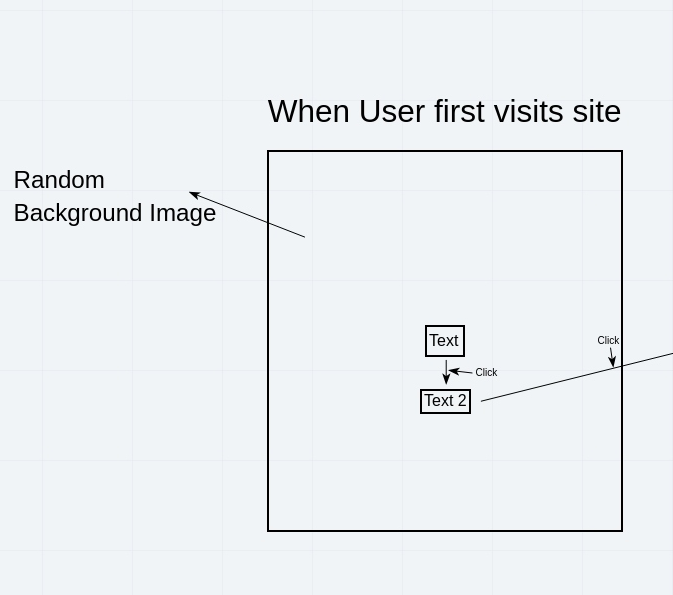
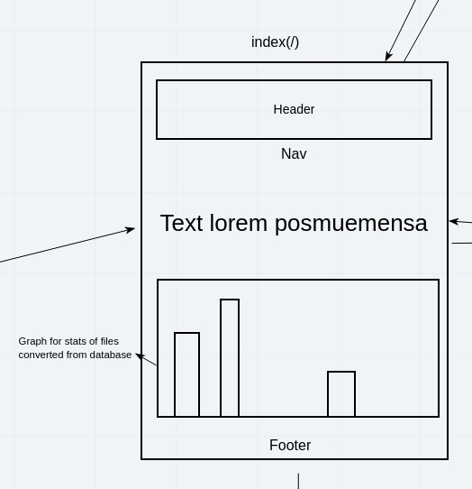
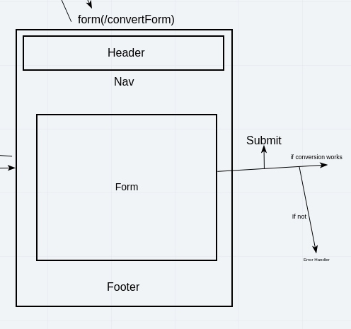
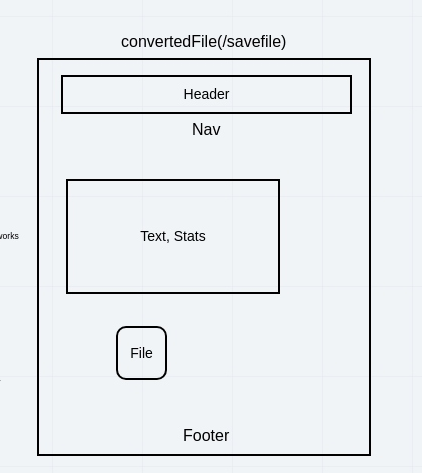
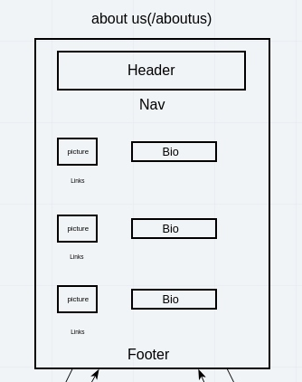
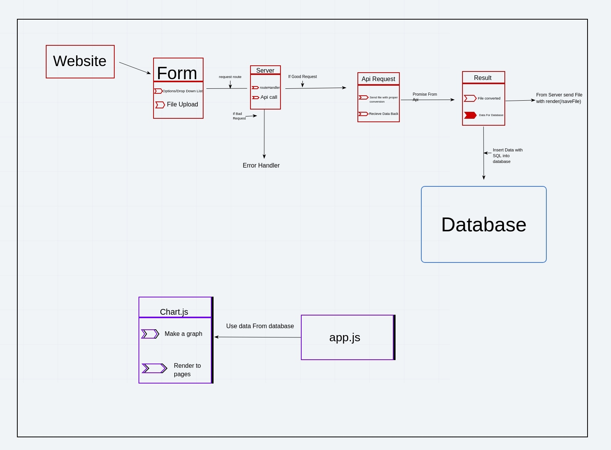
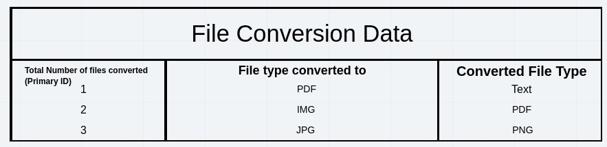

# FileConverter

# Members/Team - Cody Carpenter, Cristian Robles, Mathew Santorsola  

## Overview  
Give users access to a vairable amount of option to convert their file type into another of their choosing.

## Architecture  
Languages: SQL, Javascript, HTML, CSS , EJS, git  
Libraries: EJS, Express, superagent, postgress, CORS, dotenv Application: Heroku  

## Wireframe

  

## User Stories  

As a user I would like to be able to convert office files, images, ebooks and websites to pdfs.
    Extra Large: 3-5Days

Feature Task:
    Acceptance Task:

As a user I would like to be able to save files 
Extra small: 1Day

As a user I would like to see the total number of files parsed
    Small: 2 Days

As a user I would like to know the number of each type of file that have been parsed
Extra Small: 1Days

As a user I would like to have a nice introduction to our web app
Small: 2Days

## Software Requirements  

Vision-
        What is the vision of this product?
        To be able to convert files to your need.
What pain point does this project solve?
    Solves having to find different file converters and give you one place to convert most files.
Why should we care about your product?
        Because of this it’s ease of accessibility and broad functionality of helping you convert your files to the necessary type needed.

Scope (In/Out)-
      In-
          Our App will allow conversion of file types
          Our App will have a clean and appealing UI
          Our App will return the converted file back to user for download
          Our app will keep track and retrieve information from a database of the type of files that have been converted
          Our app will show information on conversions and how many have been done.

          Out- Should not do anything illegal or regulations with converting. And should not save any content from the user, files are dangerous.
          Minimum Viable Product vs
          What will your MVP functionality be?
          Functional Website that let you convert files
          What are your stretch goals?

          Progress Bar when converting
          Stretch
          What stretch goals are you going to aim for?
          Progress Bar when converting
          Functional Requirements
          List the functionality of your product. This will consist of tasks such as the following:
          An user can select what data type and upload file.
          An user can save their converted file.
          An user search can see information relating to conversions.
          Data Flow
          If it’s the first time the user open the site, they will shown an intro with a brief introduction, then taking to the home page where they will be Shown Stats and information About the project and giving the option to be taken to the conversion page.
          Non-Functional Requirements

          Security - All files will be sent as POST method to keep the users files secured
          Testability- Being able to test to see if all available options of files are converted to their available options.

## Domain Modeling  
  

## Entity Relationship Diagram
  

## Change Log  

2/2/2021 08:30pm Ver: 1.0.0 - Initial commit to repo with base scafolding for project.
